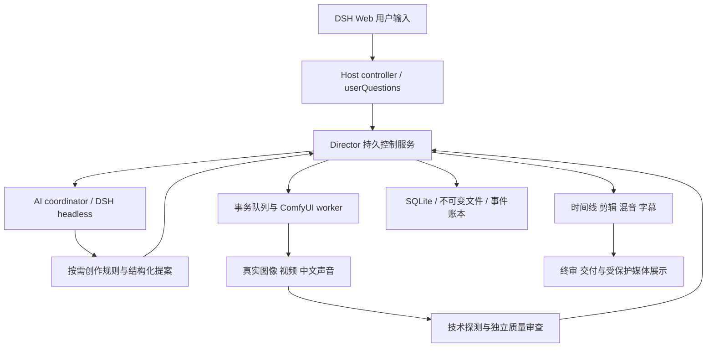

# Implementation Plan: bugu_director_skill 漫剧制作系统

**Branch**: `codex/001-director-runtime` | **Date**: 2026-10-09 | **Spec**: [spec.md](spec.md)

**Input**: 用户本轮需求、原会话和附件；治理见 [.specify/memory/constitution.md](../../.specify/memory/constitution.md)。

**交付状态**：研究/设计基线。下列目录和接口是待实现目标；不得将设计存在解读为运行能力已完成。
当前DSH固定预发布，正式发布门禁受阻。预览实现可推进，正式发布任务保持未完成。

## Summary

在DSH镜像提供一个可发现技能入口、按需创作规则、持久director服务和真实ComfyUI生产执行器。
全自动独立推进；半自动十阶段逐项等待人类批准。首版交付有声单集、跨集同脸同声、局部返修及完整归档。
吸收参考包的职责边界、引用图和版本思路，关键执行、审批、质检和剪辑重新实现；
复用合格代码也必须通过我们的合同与工作负载验收。

## Technical Context

**Language/Version**: Python3.12（镜像当前3.12.13），DSH控制插件沿用宿主Node24/TypeScript生态。
**Primary Dependencies**: Python标准库SQLite/进程/哈希，Pydantic2作边界校验，httpx作ComfyUI客户端，
Pillow作真实图像解码/四格合成，python-docx/pypdf作文本解析，固定稳定yt-dlp下载；
ffmpeg/ffprobe作媒体探测/解码/时间线/混音。测试pytest、ruff和类型检查。
以上新Python包精确版本、发行摘要、传递依赖锁须在实施T006完成并实际兼容验收，
本设计不虚构已存在的uv.lock。
**Storage**: 本地持久卷SQLite + 不可变内容哈希文件；WAL仅允许同主机本地FS，
启动检查实际SQLite版本和锁语义。WAL必须使用官方已修复WAL-reset缺陷的正式版：3.51.3及以后，
或官方修复回移分支3.50.7/3.44.6；具体制品在T006固定来源/校验及兼容性。
本仓开发Python3.12.13实测SQLite3.50.4，仅可进行本轮不使用数据库的研究检查，不能据此放行生产WAL。
ai_drama实际内嵌/系统SQLite须单独探测，迁移独立完成，不修改当前环境掩盖缺陷。
采用FULL同步、外键、短事务、CAS版本和outbox；
备份使用一致性API，不能只复制正在写的.db。
**Testing**: 单元/合同/状态故障测试，真实图像/视频/声音能力验收，独立质量复查，
DSH Web自然语言与固定镜像E2E；试验桩仅测试协议故障，不能替代生产证据。
**Target Platform**: ai_drama Linux amd64镜像 + 单GPU；Windows用于开发和离线测试。
**Project Type**: 技能包 + Python运行库/CLI/服务 + 宿主DSH控制插件集成。
**Performance Goals**: SC-014的20项目×1000资产规模下控制查询p95≤2秒；
可对账状态60秒内恢复展示；一致性备份10分钟内恢复。测量前冻结实际hardware/FS、
查询并发和计时边界、授权真实媒体/标记benchmark索引及完整备份字节清单，按quickstart执行；
结果仅适用于该profile，资产行数不能推断任意媒体数据量的恢复性能。
**Constraints**: GPU并发默认1；无默认预算/返修额度；未知提交不重发；半自动人类批准不可由AI签发；
软件地址/路径集中配置，密钥不进制品；阶段判断依靠证据。
**Scale/Scope**: 首版单主机，通过队列支持多个独立项目；不宣称主机故障自动容灾或多租户商业SLA。
**Existing upstream**: ComfyUI0.39.0/b0b743566f65daafc423b4fea8a2fbda94b3384a；
DSH0.2.1-alpha.1/5badb15009ae1756c3afe0ae0cef1faafc290ccc（Pre-release）；
版本只作兼容研究基础，不在本轮升级。

## Constitution Check

| 门禁 | 设计阶段结果 | 实现/发布要求 |
| --- | --- | --- |
| Spec Kit全链路 | 本轮形成spec/research/design/tasks，一致性独立分析 | 完成标记逐项证据核验 |
| 正式稳定上游 | DSH预发布，明确正式受阻 | T088独立稳定版迁移，不能降级门禁 |
| 真实验收 | 离线参考测试与新系统媒体验收分开 | T070–T087真实验收未完成 |
| 模式/安全/持久状态 | 独立controller审批、事务/CAS/outbox、未知提交冻结 | 自有实现和故障测试必须证明 |
| 职责/复用 | 按文件许可，受限制文本不进商用分发 | 任何借入文件保留许可和修改记录 |

Phase0研究后及Phase1设计后均检查：设计可进入实施；正式发布不可进行。
没有放宽宪章的豁免。研究未知项已明确为可执行能力试验任务，能力缺失有阻塞路径，不能伪装支持。

## Product flow and stage contracts

| 阶段 | 创作/生产职责 | 固定成果与审核重点 |
| --- | --- | --- |
| S01接入 | 先选模式；实际理解文字/图/视频，素材冲突和来源处理 | 原件、理解证据、模式、来源、可用能力 |
| S02剧本 | 简报、原著索引/映射、改编或原创、冲突节奏审查 | 可拍剧本、台词身份、审稿与因果 |
| S03风格 | 推导制作形态、线条、材质、光色和画幅 | 真实风格帧、视觉基准、初始冻结质量标准 |
| S04角色/声音 | 稳定角色、合法造型、道具状态、预置音色/发音 | 角色参考、声音样本、身份和变体区别 |
| S05场景 | 空间拓扑、机位、视线、出入口、光源、跨景 | 场景参考与空间/灯光事实 |
| S06配音/分镜/四格 | 逐句配音实测时长→镜头职责/表演/运镜→独立原帧→四格 | 对白、镜头表、独立关键帧、四格顺序映射 |
| S07视频 | 工作流能力编译、真实提交、对账、下载归档 | 实际片段、输入快照、任务及生产身份 |
| S08质检/返修 | 实际看片听音、定位问题、局部修改、前后对照 | 技术/语义检查、失败候选、修复假设、通过版本 |
| S09剪辑 | 镜序/入出点、声音事件、整集配乐、字幕、混音 | 可重建时间线、有/无字幕候选及分轨 |
| S10终审/交付 | 完整终审、通过决策、规范清单及成果展示 | 最终版本、质量报告、所有候选索引、交付说明 |

S01模式询问是前置动作，S01素材报告在半自动也需审核。全自动相同阶段依赖，审批由AI质量决策推进；
自动审查者使用独立任务上下文，必须读取实际产物，不共享创作者的自我通过断言。
半自动每阶段有详细审核包，显著修复后重新审核。循环返修不制造永久“已通过”单调假象：
输出变化导致stage revision增加，受影响审批失效；不影响的资产/阶段可保持引用。

## Architecture and boundaries



- skill入口只负责自然语言路由、项目/模式和阶段职责，不存储唯一运行状态、不发无追踪的长任务。
- 创作模块只提交自己拥有的事实/产物提案；生产执行器验证依赖快照并登记请求。
- director是状态唯一写入者；AI/CLI不能直接编辑ledger数据库，不能用exit0标成功。
- worker拥有受控媒体生产和落盘权限，不能签发人类批准；质量模块保存观察与证据，不能篡改素材。
- Host controller接收官方用户问答，凭隔离权限签发审批；接入媒体展示沿用已验收受保护入口。
- CLI短命令通过本机受控服务协议调用init/start/status/review/revise/pause/resume/cancel/export。
  `approve`供可信controller或人工管理入口，制作AI无该签发身份。
- ai_drama的新控制插件是自有官方扩展机制实现，不改DSH或ComfyUI源；
  当前社区dsh-comfyui仅用于经验收展示，不承担本项目耐久任务状态。

### DSH configuration

入口 `skills/bugu-director-skill/SKILL.md`，frontmatter name=`bugu-director-skill`；
产品/仓库继续 `bugu_director_skill`。通过`DSH_BUNDLED_SKILL_DIR`或官方filesystem provider配置挂载。
不依赖任意嵌套SKILL递归发现，专业规则放references。

coordinator使用专属profile/project cwd/session，模型/provider明确配置。
视觉探测采用官方模型inputModalities；还须真实图像调用，不能只检查metadata。
全自动使用官方`DSH_PERMISSION_MODE=danger-full-access`并按project scope运行，
审批never的含义是拒绝仍需要审批的工具，不是全部自动批准；缺工具能力仍阻塞。
不提供虚构`approve(all)`。主机UID/卷权限继续界定项目权限，不自动root或修改其它会话。

半自动coordinator仅可调用受控制作操作/项目工作区shell；签发端置于独立UID或独立服务能力域。
Host工具内部构造审核摘要，直接await `ctx.userQuestions.ask` 接收官方用户响应，再提交receipt；
不得接受AI传来的`approved=true`或自编用户文本作为通过依据。
官方Web answerer与agent scope绑定；明确同意选项推进，自由文本进入修改/解释，模糊回答继续待审。
无限等待问答在Web主agent，headless只写pending review并退出当前决策任务，不自己等待。
重启恢复审核包，显式显示同一digest或新revision。
若让AI持有宿主root/签发方同UID的全部权限，不能保证批准防伪；该部署不满足半自动验收。

### Persistence and request fence

每个写操作有command_id、expected_revision、project_id和可认证actor。
数据库事务保存状态+事件+outbox，worker在lease和fencing epoch下领取。
请求提交前保存canonical graph hash、client prompt UUID、输入digest和attempt id。
禁用对POST /prompt的通用HTTP自动重试。

- 未发网络请求的queued任务可重新领取。
- submitting期间网络失败或进程崩溃→submission_unknown，查询queue/history及已登记输出。
- 已确认prompt_id在running/done时继续跟踪，不重发。
- queue/history为空，特别是ComfyUI重启后，不构成“未执行”的证明。
- 无法恢复任务身份→blocked_unknown；controller/操作人员确认远端静止及可能成果后，
  显式创建有audit的replacement attempt；保留可能重复的风险及全部候选。
- worker lease过期不授予重复外部submit资格；永久request fence独立于临时lease。
- ComfyUI客户端UUID没有去重保障，项目不承诺exactly-once。
- 取消队列任务使用准确ID；全局interrupt可能影响别的项目，
  只有GPU独占所有权证据成立才能使用，不能无条件打断外部用户任务。

产物先写临时文件，完整解码/哈希、fsync并原子改名后登记。
DB登记失败时重启扫描持久attempt目录，按manifest恢复孤儿；禁止只因目标文件已存在阻止恢复。
修改使用CAS和事务，不能“加载JSON→修改→覆盖”造成索引丢失。
通过状态受物理文件hash约束，被外改即invalid，不沿用旧质量和批准。

### Capability registry and deterministic compilation

能力包含image_create、reference_image、image_edit/mask、video_i2v/start_end/multiref/grid、
tts_zh、asr_zh、sfx、music、lip_sync/time_edit。只登记真实可用的子集，缺项即显式阻塞。
工作流留原UI图和API派生图、绑定schema、节点实现身份、模型revision/hash、license、VRAM、原生规格、
参数范围、输出节点、真实样例与验收ID。版本变化自动使该能力待重新验收。
AI决定内容，确定性编译器检查必填/引用/尺寸/输入类型/工作流参数，不能发任意未经目录验收图。

首次验收通过管理员`capability-trial`创建独立ValidationRun/TrialGrant，冻结图/模型/节点/输入/许可及期望。
编译器purpose=production时只用validated，purpose=validation时核验独立管理grant和snapshot，
试验复用持久request fence/未知对账和实际媒体检查，不进入项目阶段、业务选片或交付。
可信独立签收全部必需测试证据并CAS确认依赖未变后才令该版本validated；缺证据/失败/unknown不启用。
T040定义导入/试验合同，T041实现共享编译与trial runner；T071–T074用该入口实际验收，
避免首次试验被业务准入门永久拦住，也不提前伪标已验收。

先独立关键帧后四格合成，避免拼图生成污染身份；格子是规划和审查产物。
视频通常从独立帧/首尾帧/多参考生成；整四格直输是独立experimental能力，
需证明正确镜序、无网格残留及身份一致后才开放。
不继承参考H3机械词数规则：提示词以事件、动作、空间、对白和能力覆盖验收，
文字长度仅服从真正厂商/本地工作流边界。供应商语法局限在adapter/compiler。

### Quality and automatic repair

质量标准在S03首次冻结，后续用户/自动修订增加版本，不能偷偷降低。
技术门自动完整解码；语义门检查实际媒体，保存镜头时间、抽帧与声音证据，
必要时对动作密集区提高采样或逐帧；不能以首帧代表全视频。
硬失败/不确定单独判定，软评分只排序候选。
AI制作与审查分任务上下文，终审覆盖成片整体而非各镜通过的简单求和。

返修顺序：错误定位→单变量修复假设→冻结身份/场景/声线→能力选择→只重建影响闭包→实际对比。
如工具不具备蒙版/时间窗口/口型编辑，重做受影响镜头；不能声称像素级局部修复。
三轮不同假设均没有实测改善且仍有硬失败→stalled，
保存最佳候选及判断依据；可以后来配置新已验收能力或收到新需求后继续。
统计实际调用量、GPU/服务用量和费用；费用不可知标unknown，不杜撰费用或剩余时间。

### Audio, timeline and delivery

中文声音选已授权稳定预置voice_id，记录模型/版本及样本；
实测wav→转写核对→发音修订→时长用于分镜，完整保存台词。
视频原生生成音轨需核对；若与指定台词/声线冲突，明确替换为声轨并记录，不能无证据声称口型一致。
音效关联剧情事件；配乐按整集时间线组织，不逐镜任意换风格。
FFmpeg执行来自结构化时间线，subprocess参数列表，不拼shell字符串。
字幕逐句对齐，混音两遍loudness校准；交付规格见spec假设，
音画/口型对齐必须逐镜真实复核，缺lip-sync能力时不能承诺任意视频均能修好。

项目路径：
`projects/<project_uuid>/episodes/<episode_uuid>/{sources,creative,assets,frames,attempts,reviews,timeline,deliveries}`。
身份不从用户标题构造路径；所有相对路径解析后检查边界、拒绝符号链接穿越。
资源名规范，原件只读，failed/superseded/cancelled候选不删除、不混入final。
成片复制到配置的ComfyUI输出子目录，登记file/subfolder/type；
受保护媒体地址不依赖ComfyUI临时history；测试大文件Range、鉴权、下载和重启。
镜像没有用户项目/密钥/模型；制品包包括skill、wheel、manifest、许可/SBOM和迁移/恢复说明。

## Project Structure

### Documentation (this feature)

```text
specs/001-director-runtime/
  spec.md / plan.md / research.md / data-model.md / quickstart.md / tasks.md
  contracts/cli.md / lifecycle.md / production.md / review.md / delivery.md
  research/source-context.md / core-suite.md / supporting-suites.md / upstream-integration.md
  checklists/requirements.md
  evidence/reference-inventory.json / core-research.json / supporting-research.json
  evidence/upstream-research.json / planning-validation.json / planning-analysis.json
  evidence/git-sync.json                # planning sync first; product sync remains pending
```

### Target source layout (not yet implemented)

```text
skills/bugu-director-skill/SKILL.md
skills/bugu-director-skill/references/     # stage-specific original writing/visual/audio/review rules
src/bugu_director/
  config.py / cli.py / errors.py / observability.py
  domain/                               # typed entities, state/dependency rules
  storage/                              # sqlite migrations, CAS, outbox, manifests
  control/                              # local API, authenticated command/review handlers
  control/capability_trials.py           # admin grants and acceptance, planned
  orchestration/                        # stages, leases, recovery, coordinator
  orchestration/capability_trials.py     # isolated trial runner, planned
  adapters/                             # DSH headless, ComfyUI, download/input readers
  creative/                             # source/brief/script/assets/shots compilers
  media/                                # decode, frame/grid, audio, timeline/export
  quality/                              # technical/semantic evidence, repairs, final review
  packaging/                            # fixed skill/wheel/manifest and verification
tests/unit/ / contract/ / integration/ / acceptance/
workflows/                              # fixed licensed registry; production validated, trials gated
deploy/                                 # integration contract and release metadata
tools/research_inventory.py              # present: research-only read-only inventory
```

DSH Host control plugin、Dockerfile、profile seed、supervisor/health集成在ai_drama独立feature/worktree实现。
先登记跨仓接口及skill/wheel release身份，再构建同一版本；不在本仓虚构ai_drama文件。
当前ai_drama未提交内容不覆盖。

## Milestones and execution

| 里程碑 | 内容 | 通过条件 |
| --- | --- | --- |
| M0研究 | 全目录快照、31入口、实现/缺陷/许可、上游核实 | 每结论可溯源；离线/真实验收分开 |
| M1设计 | 本轮spec/plan/research/data-model/contracts/tasks/一致性 | 核心需求全任务覆盖；文档门通过 |
| M2运行基础 | 配置、实体、SQLite、CAS、outbox、队列、CLI、控制、恢复 | 状态/批准/未知提交故障测试通过 |
| M3创作生产 | 多模态、原创创作规则、资产/声音、镜头/四格、真实ComfyUI | 每能力独立真实验收，能力空白不假完成 |
| M4单集交付 | 质检返修、声音/字幕/时间线/终审/归档 | 60–90秒主样片与约30秒复用片段通过 |
| M5镜像集成 | 固定制品、DSH入口/控制插件、supervisor/健康/卷 | 自然语言E2E，新/旧卷、恢复/回滚、播放下载 |
| M6正式发布 | 稳定上游迁移、商业许可、全部真实门、远端同步 | 稳定与业务门同时通过；当前受阻 |

任务按用户故事组织，依赖见tasks。MVP先证明输入/审核/恢复控制闭环，
然后完成有声单集；提示词或片段不能标M4完成。
GPU/模型能力试验优先于大批量内容生成，避免在后期发现声音或四格路径不可用。
没有用“约几周”替代验收的硬性时间承诺；评估人员与GPU环境后可在独立进度记录维护估算。

## Acceptance and change management

quickstart与合同给出可执行验收场景，tasks绑定FR/SC及证据路径。
真实验收保存固定原始素材、实际请求/日志摘要、输出hash、完整探测/解码、
独立逐镜观察、批准/返修/恢复事件、运行/镜像身份和最终说明。
未运行/failed/unknown保持未完成；测试协议桩明确标记test double，不作为媒体或项目验收样本。
要求类型迁移采用schema版本与受控数据迁移；旧数据原件保留，演练一致性备份恢复。
修改任何prompt/工作流/模型/代码会标明影响，更新spec/plan/tasks、能力状态、回归与release身份。
稳定上游升级是独立change，不能在故障修复时追踪latest/main。

## Complexity Tracking

无违反宪章的复杂性豁免。
独立持久服务是浏览器断开/重启/审批/未知提交所需；SQLite是当前单主机最小可行事务存储，
不增加Redis/Kafka/Kubernetes或多供应商空适配器。
GPU不足、模型未验收、稳定DSH缺失是如实阻塞，不用架构承诺掩盖。
