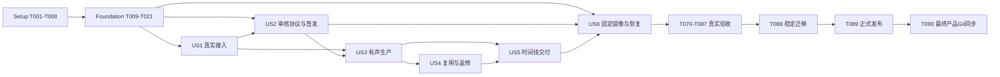

# Tasks: bugu_director_skill 可恢复的 AI 漫剧制作系统

**Input**: `specs/001-director-runtime/spec.md`、`plan.md`、`data-model.md`、`contracts/`、`research/`、`evidence/`。

**Status**: 研究与设计基线；产品实现、真实媒体、镜像和正式发布未完成。当前 DSH 预发布导致正式发布受阻，允许明确标识的预览实施。

**Tests**: 用户 AGENTS 与宪章要求充分且真实的测试。单元／合同／协议故障注入只证明相应协议，真实媒体、官方问答、镜像及发布独立验收。测试先表达行为与失败边界，再实现，不能写镜像实现的空断言。

**Format**: `- [ ] Txxx [P?] [USx?] 动作与精确路径；依赖；FR/SC；完成证据`。`[P]` 仅表示列出的依赖完成后可与不同文件任务并行；不授权在同一 GPU 或破坏性故障环境并行。任务以仓库根为相对路径基准。

**完成规则**：只有实际成果、相应真实检查及验收证据齐全才勾选。T001–T004 确认本轮研究，T005 确认已完成独立复查的设计门；都不确认产品能力。T006–T090 全部未完成；文档存在、退出码 0、未运行的测试和 capability metadata 均不能代替验收。

## Phase 1: Setup — 研究基线与实施工具

**目的**：保全需求上下文和参考证据，建立可安装、可追溯的开发与依赖基线。

- [x] T001 盘点参考目录全部 871 文件／31 入口并保留原会话及附件的需求来源，在 `tools/research_inventory.py`、`specs/001-director-runtime/research/source-context.md`、`specs/001-director-runtime/evidence/reference-inventory.json` 记录只读哈希、范围及历史计数差异；依赖无；FR-004、FR-036、FR-039；SC-012、SC-013；证据为当前清单和来源记录，不表示全部媒体已观看。
- [x] T002 深读核心 11 入口及关键源码、只读运行 89+5 离线测试和受控缺陷探针，在 `specs/001-director-runtime/research/core-suite.md`、`specs/001-director-runtime/evidence/core-research.json` 区分 14 项缺口与真实验收边界；依赖 T001；FR-032、FR-036、FR-039；SC-011、SC-012、SC-013；总包失败与未验收项不得改写成通过。
- [x] T003 完整调查其余专业／辅助入口和 132 运镜媒体来源，在 `specs/001-director-runtime/evidence/supporting-research.json` 保存逐文件阅读、许可、源码／文档差异及隔离离线实验；依赖 T001；FR-003、FR-032、FR-036、FR-039；SC-012、SC-013；该 JSON 已有记录，生产／视觉未验收仍保留。
- [x] T004 核实 DSH、ComfyUI、社区插件及 ai_drama 当前固定来源，在 `specs/001-director-runtime/research/upstream-integration.md`、`specs/001-director-runtime/evidence/upstream-research.json` 记录正式版／预发布、官方权限／问答／媒体接口和未执行项；依赖 T001；FR-030、FR-031、FR-034、FR-035；SC-009、SC-011、SC-012；当前正式发布受阻不得解除。
- [x] T005 对 `specs/001-director-runtime/spec.md`、`plan.md`、`data-model.md`、`contracts/`、`tasks.md`、`checklists/requirements.md` 及 `README.md`、`docs/enterprise-plan.md`、`THIRD_PARTY_NOTICES.md`、`licenses/spec-kit-MIT.txt` 执行 Spec Kit 独立语义一致性分析，并真实运行 `tools/validate_planning.py` 检查结构／40 FR＋14 SC 显式映射／本地链接／JSON；分别记录结构结果至 `specs/001-director-runtime/evidence/planning-validation.json`、独立语义分析和修订复查至 `evidence/planning-analysis.json`；依赖 T001–T004；FR-036、FR-039；SC-012、SC-013；首轮1 HIGH/2 MEDIUM和复查1 LOW已修，独立有限复查PASS；结构 PASS 不代表生产验收，产品任务和真实验收仍未完成。
- [ ] T006 固定 Python 3.12 兼容的实际依赖版本、传递锁和发行摘要，建立 `pyproject.toml`、`uv.lock`、`deploy/dependency-lock.json`、`deploy/sbom.json`；同时选择已修复官方 WAL-reset 问题的正式稳定 SQLite runtime，固定发行来源／提交或源码摘要，并记录实际 Python 导入的 SQLite 版本及编译配置，不只锁 Python 版本；依赖 T004、T005；FR-030、FR-032、FR-034、FR-035；SC-010、SC-011；真实安装／导入／CLI 构建及 SQLite 修复版本准入验证写 `specs/001-director-runtime/evidence/dependency-compatibility.json`，当前本机 Python 3.12.13 内嵌 SQLite 3.50.4 不可作为生产 WAL 基线，预发布 DSH 只可标预览，不修改本机或 ai_drama 环境掩盖缺口。
- [ ] T007 [P] 将允许复用的纯代码与嵌入创作文本逐文件分离审核，在 `LICENSE`、`NOTICE`、`deploy/reuse-manifest.json` 和 `tests/contract/test_distribution_rights.py` 实施许可、来源／修改记录及分发排除检查；依赖 T005；FR-036、FR-039；SC-012、SC-013；禁止受限或许可不明内容进入商业制品。
- [ ] T008 [P] 配置 `pyproject.toml` 中 pytest／ruff／类型检查与 `.github/workflows/ci.yml`、`tests/conftest.py` 的隔离运行环境，明确 real-media／gpu／host 验收标记和证据目录；依赖 T006；FR-039；SC-013；缺硬件的检查不得伪装运行成功，CI 不保存凭据或客户素材。

**检查点**：实施设计一致，依赖可以真实安装，许可分发边界明确；不表示媒体生产或正式发布通过。

## Phase 2: Foundation — 所有故事的持久运行前提

**目的**：建立状态唯一写入口、认证身份、事务、文件安全、请求 fence 和可恢复服务。

- [ ] T009 在 `src/bugu_director/domain/models.py`、`domain/schemas.py`、`tests/unit/test_domain_invariants.py` 定义业务及 ValidationRun/TrialGrant 实体、互斥 owner/purpose 和拒绝非法输入；依赖 T005、T006；FR-025、FR-026、FR-039；SC-002、SC-006、SC-013；落实“ID为运行库生成的规范UUID；用户标题不参与目录构造”和“每个引用必须指定对象ID、版本及digest，禁止仅用‘latest’”。
- [ ] T010 实现 `src/bugu_director/storage/database.py`、`storage/migrations/001_initial.sql`、`storage/transactions.py` 的本地 SQLite、外键／FULL 同步、短事务／busy 处理、CAS 和 command/event/outbox 原子提交，并在 `tests/unit/test_sqlite_runtime_admission.py` 验证实际加载引擎的正式版本／修复资格与配置，启动拒绝受 WAL-reset 影响的引擎进入多连接 WAL；依赖 T009、T006；FR-025、FR-026、FR-027、FR-034；SC-006、SC-011、SC-013；落实“revision为从1开始的正整数；写操作必须携带expected_revision并以CAS提交”，同 command_id 异 payload 必须冲突；单写协调或 GPU 并发1不能替代 SQLite 官方修复版本。
- [ ] T011 [P] 在 `src/bugu_director/storage/artifacts.py`、`storage/paths.py`、`tests/unit/test_artifact_boundaries.py` 实现不可变落盘、最终字节 SHA、fsync／rename 和 manifest 孤儿重接；依赖 T009；FR-025、FR-026、FR-030；SC-005、SC-006、SC-008；落实“digest为最终字节/规范结构的64位小写SHA-256”“相对路径resolve后必须仍在配置根内；禁止父级、绝对路径和符号链接/重解析点越界”及默认版本退役不物理删除。
- [ ] T012 [P] 实现 `src/bugu_director/config.py`、`control/auth.py`、`control/server.py` 的集中配置、loopback／Unix socket、可认证 actor 与读／制作／管理／human-approval 能力隔离；依赖 T009、T010；FR-025、FR-030、FR-031；SC-002、SC-010；制作 AI 身份不得持有批准签发凭据，缺权限返回真实拒绝。
- [ ] T013 在 `src/bugu_director/cli.py`、`control/commands.py`、`tests/contract/test_cli_contract.py` 实现 cli.md 全部命令、command_id／expected_revision、JSON schema 和 exit0/2/3/4/5/6/7 语义；依赖 T010、T012；FR-001、FR-028、FR-038；SC-006、SC-009；命令成功受理不能标媒体通过，无追踪长 shell 生产必须拒绝。
- [ ] T014 在 `src/bugu_director/domain/lifecycle.py`、`domain/dependencies.py`、`tests/unit/test_lifecycle_and_dependencies.py` 实现 Project／Stage／Task 状态机、依赖 DAG 和阶段接受门；依赖 T009、T010；FR-019、FR-024、FR-025、FR-026、FR-029；SC-002、SC-005、SC-006；unknown 不推进，依赖变化用事务递增 revision，拒绝环与跨项目隐式引用，S10 export_pending 可恢复。
- [ ] T015 [P] 在 `src/bugu_director/domain/capabilities.py`、`storage/capabilities.py`、`tests/unit/test_capability_revocation.py` 实现固定工作流／节点／模型／硬件／许可／验收身份目录；依赖 T009、T010；FR-012、FR-030、FR-032、FR-034；SC-011、SC-012；“status=unverified/validated/revoked；只有validated可业务生产；任何依赖变更撤销验收”，无实际样例不得 validated。
- [ ] T016 在 `src/bugu_director/orchestration/queue.py`、`orchestration/leases.py`、`storage/request_fences.py` 实现持久任务、outbox 消费、worker lease／fencing epoch 与永久外部 request fence；依赖 T010、T014、T015；FR-024、FR-026、FR-027；SC-006、SC-014；GPU 默认并发 1，lease 回收不得解除已经提交或未知的请求 fence。
- [ ] T017 在 `src/bugu_director/adapters/comfyui.py`、`orchestration/worker.py`、`orchestration/reconcile.py` 实现 prepare／submit／poll／fetch／cancel 和提交后对账；依赖 T011、T015、T016；FR-013、FR-024、FR-026、FR-027、FR-028；SC-006；禁用 POST 自动重试，history 空不证明未执行，准确任务取消，全局 interrupt 需 GPU 独占证据，不承诺上游 exactly-once。
- [ ] T018 [P] 实现 `src/bugu_director/adapters/dsh.py`、`orchestration/coordinator_context.py` 的专属 profile／project cwd／session、官方 headless 事件、模型 inputModalities 和真实视觉探测；依赖 T012、T014；FR-003、FR-024、FR-030、FR-031；SC-001、SC-006、SC-009；半自动 headless 不等待问答，写 pending review 后退出当前决策任务；全权限使用官方项目配置，不伪造 approve(all)。
- [ ] T019 在 `src/bugu_director/orchestration/coordinator.py`、`orchestration/supervisor.py` 实现浏览器无关的十阶段持久推进、checkpoint、暂停／模式切换／恢复与优雅停止；依赖 T013、T014、T016–T018；FR-019、FR-023、FR-024、FR-026、FR-028、FR-031；SC-002、SC-003、SC-006；制作服务不得直接编辑状态库或以子进程 exit0 认定阶段通过。
- [ ] T020 [P] 实现 `src/bugu_director/errors.py`、`observability.py`、`control/health.py` 的结构化故障、事件、服务／GPU／磁盘状态与用量；依赖 T010、T012；FR-023、FR-030、FR-038；SC-006、SC-014；落实“时间为带时区的UTC”“nullable费用代表unknown，0只代表明确测得0；未观察的质量不能标pass”，用户界面不虚构 ETA。
- [ ] T021 在 `tests/contract/test_foundation_faults.py`、`tests/integration/test_request_recovery.py` 验证并发 CAS、过期 worker、产物写后 DB 失败、outbox 未发、提交响应丢失、history 丢失、磁盘不足、取消晚到和非法身份；依赖 T009–T020；FR-024–FR-028、FR-030、FR-031、FR-039；SC-002、SC-006、SC-013；协议 fault doubles 只模拟故障，写明控制证据范围，不能成为真实业务媒体。

**检查点**：所有 Foundation 合同和故障检查通过；真实 GPU／媒体／宿主行为仍由 T070–T087 验收。

## Phase 3: User Story 1 — 真实素材接入（P1，首个可用增量）

**Goal**：从真实输入建立模式、来源、理解证据和制作简报，无模式或缺理解能力时拒绝依赖生产。

**Independent Test**：真实文字／多图／本地视频／直接 URL／公开网页输入可整理为简报；损坏、获取失败或缺视觉分别得到真实拒绝。此阶段无需生成影片。

- [ ] T022 [P] [US1] 在 `tests/contract/test_input_and_mode.py` 编写无模式、重复模式、安全模式切换、五种输入类型、损坏文件与引用越界行为测试；依赖 T021；FR-001、FR-002、FR-003、FR-004、FR-031；SC-001；测试输入标来源，未读取内容不得造 observed 结论。
- [ ] T023 [US1] 在 `src/bugu_director/control/projects.py`、`domain/mode_receipts.py` 实现项目 init／mode 与真实用户选择绑定；依赖 T022；FR-001、FR-019、FR-025、FR-028、FR-031；SC-001、SC-002；“mode初始null；无模式receipt不得生产”，切模式到安全检查点并更换运行身份，恢复沿已有 receipt 不重复询问。
- [ ] T024 [P] [US1] 在 `src/bugu_director/adapters/document_readers.py`、`creative/source_index.py` 实现 TXT／Markdown／DOCX／PDF 真实解析和长文段落／章节索引，保留原件及原文位置；依赖 T022、T011；FR-002、FR-004、FR-005；SC-001；扫描 PDF 缺 OCR 时明确 blocked，ZIP／文件名穿越与解压资源上限拒绝。
- [ ] T025 [P] [US1] 在 `src/bugu_director/adapters/downloads.py`、`tests/integration/test_url_boundaries.py` 实现直接媒体和受支持公开网页真实下载，每次 DNS／重定向核验协议／地址与显式内网 allow 配置；依赖 T022、T012；FR-002、FR-004、FR-030；SC-001、SC-010；拒绝默认私网／回环／元数据地址，限定字节、时长、时间，失败原因与授权来源可追溯。
- [ ] T026 [P] [US1] 在 `src/bugu_director/media/input_probe.py`、`media/reference_frames.py`、`creative/observations.py` 实现图片解码／实际视觉理解、本地视频有界 ffprobe／PTS 抽帧、音轨分析和真实转写；依赖 T022、T018；FR-003、FR-014；SC-001；observed/inferred/unknown 分开，动态区域提高采样，不遍历未请求整条长片，缺视觉／ASR 阻塞相应结论。
- [ ] T027 [US1] 在 `src/bugu_director/creative/intake.py`、`storage/sources.py` 合并来源、用途、授权声明、冲突和理解证据，区分 story／identity／style／action，保存不可变 source_map；依赖 T023–T026；FR-002、FR-004、FR-025、FR-036；SC-001、SC-012；同一项目 Episode.sequence 唯一，跨集复用必须固定版本。
- [ ] T028 [US1] 独立编写 `skills/bugu-director-skill/SKILL.md`、`references/intake.md`、`references/operations.md` 的自然语言路由、先选模式、恢复已有项目、查询／审核／修订／取消／导出入口；依赖 T013、T023、T027；FR-001、FR-028、FR-033、FR-038；SC-009；frontmatter name 为 bugu-director-skill，专业规则按需读取，不假定递归发现嵌套 SKILL。
- [ ] T029 [US1] 在 `src/bugu_director/creative/brief.py`、`skills/bugu-director-skill/references/brief.md` 实现 S01 通俗素材报告与简报，保留实际媒体链接、来源限制和缺口；依赖 T027、T028；FR-004、FR-005、FR-020、FR-038；SC-001、SC-009；通过 review package 接口交审核，不由创作模块直接推进。
- [ ] T030 [US1] 在 `tests/integration/test_intake_journey.py` 检查真实原件→模式→理解→简报、不同项目隔离和无法理解的阻塞路径，保存机器／人工对照至 `specs/001-director-runtime/evidence/us1-intake.json`；依赖 T022–T029；FR-001–FR-004、FR-025、FR-039；SC-001、SC-013；真实五路径最终门另见 T070。

## Phase 4: User Story 2 — 十阶段逐项人类审核（P1）

**Goal**：每阶段形成详细通俗审核包，真实用户批准、修改或停止；问答中断／重启仍待审。

**Independent Test**：使用已授权实际图像／声音／视频审核包验证批准与拒绝、修改后版本失效、跨项目／重放拒绝、问答中断后恢复。无需先完成全自动样片。

- [ ] T031 [P] [US2] 在 `tests/contract/test_review_authority.py`、`tests/contract/test_review_lifecycle.py` 编写十阶段未答／超时／AI approved=true／跨项目／重放／旧哈希均不得推进，以及 revise/stop 行为；依赖 T021；FR-019、FR-021、FR-022、FR-025、FR-031；SC-002；trusted receipt 与测试 actor 分开，测试不能签发业务人类批准。
- [ ] T032 [US2] 在 `src/bugu_director/control/review_packages.py`、`creative/review_summary.py` 实现冻结 summary＋规范媒体 manifest、理由／质量／问题／文件／修改影响，包绑定 project/stage/revision/input_digest/artifact_digest；依赖 T031、T011、T029；FR-019、FR-020、FR-037、FR-038；SC-002、SC-009；缺实际媒体明确缺项，不能只发文字声称审过。
- [ ] T033 [US2] 在 `src/bugu_director/control/approvals.py`、`storage/approval_receipts.py` 实现可认证 human／auto_quality 分离、nonce／scope／revision／两 digest 校验和一次性消费；依赖 T031、T032、T012；FR-021、FR-025、FR-031；SC-002；“半自动必须human且签发方可信；decision=approve/revise/stop”，AI、无真实问答、物理文件变化拒绝。
- [ ] T034 [US2] 在 `src/bugu_director/control/revisions.py`、`storage/invalidation.py` 实现自然语言修订提案、owner 校验、影响闭包与批准同步失效，stop／模糊答复仍按合同处理；依赖 T033、T014；FR-022、FR-025、FR-029；SC-002、SC-005；修订不可覆盖通过文件，重新生成新 revision 审核包。
- [ ] T035 [US2] 在 `src/bugu_director/control/review_stage_gate.py`、`orchestration/semi_mode.py` 接入 S01–S10 全部阶段的持久 await_review／human_accepted 门，暂停后生产 worker 不能绕过；依赖 T033、T034、T019；FR-019、FR-021、FR-022、FR-024；SC-002、SC-006；进程结束、超时和会话离线不得产生批准。
- [ ] T036 [US2] 在 `deploy/dsh-controller-contract.json` 登记 ai_drama 独立 Spec Kit feature 的真实插件路径／版本，并完成隔离 Host 签发端对官方 `ctx.userQuestions.ask`／Web answerer 的集成与认证 IPC；依赖 T032、T033、T035、T018；FR-020、FR-021、FR-030、FR-031；SC-002、SC-009；签发方独立 UID／服务能力域，handler 自行构造问题并直接消费真实 scope 响应，制作 shell 不持有凭据；仅写合同不得完成此任务。
- [ ] T037 [US2] 在 `src/bugu_director/control/pending_reviews.py`、`orchestration/review_recovery.py` 及 T036 已登记插件路径实现问答超时／异常／重启恢复：数据库待审独立于官方问答 projection，Web 主 agent 重建同 digest／新 revision 提问；依赖 T036、T035；FR-021、FR-024、FR-026、FR-028、FR-038；SC-002、SC-006；headless 退出不能删除待审状态，模糊自由文本不能批准。
- [ ] T038 [US2] 在 `tests/integration/test_semi_mode_recovery.py` 核对真实批准路径、拒绝修订、十阶段门、签发端隔离和问答恢复，记录 `specs/001-director-runtime/evidence/us2-review-control.json`；依赖 T031–T037；FR-019–FR-022、FR-026、FR-031、FR-039；SC-002、SC-006、SC-013；协议测试通过后仍需 T075 的实际镜像／Web 用户验收。

## Phase 5: User Story 3 — 全自动有声单集（P1）

**Goal**：真实创作、图像／视频／声音生产、独立质量审查和持续自动推进，满足标准或如实阻塞。

**Independent Test**：生成 60–90 秒、8–12 镜头、2 角色／2 场景／至少 2 四宫格，有对白／道具交接／跨景／音效／配乐／字幕；浏览器断开仍推进。最终成片与独立逐镜验收由 T076–T077 完成。

- [ ] T039 [P] [US3] 在 `tests/contract/test_workflow_bindings.py`、`tests/contract/test_quality_verdicts.py` 表达管理员 trial grant／用途隔离／真实签收、capability 版本撤销、UI/API 图映射、类型／尺寸／引用范围、hard fail／unknown 不通过等行为；依赖 T021、T015；FR-012、FR-014、FR-015、FR-032；SC-003、SC-007、SC-011；只测合同，不以协议样例冒充媒体。
- [ ] T040 [US3] 在 `src/bugu_director/adapters/workflow_import.py`、`workflows/registry.json`、`workflows/bindings/` 实现固定 UI 源／API 派生图、节点／模型 hash／许可／VRAM／原生规格／参数范围与验收引用导入，并在 `domain/capability_trials.py`、`tests/contract/test_capability_trials.py` 定义 ValidationRun/Grant、隔离输出和签收状态机合同；依赖 T039、T015、T007；FR-012、FR-013、FR-032、FR-036；SC-003、SC-011、SC-012；不存在／未验收类型不得创建空生产实现，真实 capability 签收见 T071–T074。
- [ ] T041 [US3] 在 `src/bugu_director/adapters/request_compiler.py`、`creative/production_snapshots.py` 编译确定性 ComfyUI 请求和完整引用快照；在 `src/bugu_director/control/capability_trials.py`、`orchestration/capability_trials.py` 实现管理员 capability-trial 及独立试验 runner：purpose=production 强制 validated，purpose=validation 核验固定 snapshot／管理 grant，复用持久 fence／未知对账，独立真实签收后 CAS 启用；试验文件不得进入业务阶段／选片，正文／输入／输出节点一致；依赖 T040、T017；FR-010–FR-013、FR-027、FR-032；SC-003、SC-006；供应商语法只在 compiler，拒绝任意未经目录验收的图和机械继承 H3 词数法。
- [ ] T042 [P] [US3] 在 `src/bugu_director/creative/script.py`、`skills/bugu-director-skill/references/script.md`、`references/continuity.md` 实现 S02 简报到可拍剧本／审稿／章节原文映射与完整对白锁；依赖 T030、T018；FR-005、FR-010、FR-025、FR-036；SC-003、SC-012；目标／冲突／节奏／因果／可制作性实际审查，不能压缩删除原稿关键事件。
- [ ] T043 [US3] 在 `src/bugu_director/creative/style.py`、`quality/profiles.py`、`skills/bugu-director-skill/references/style.md` 实现 S03 风格推导、真实基准帧和首次冻结质量 profile；依赖 T041、T042；FR-006、FR-014、FR-015、FR-023；SC-003、SC-007；画风／构图／光材理由保留，标准修订增版本和影响记录，不降低标准骗过失败。
- [ ] T044 [P] [US3] 在 `src/bugu_director/creative/identities.py`、`creative/props.py`、`skills/bugu-director-skill/references/characters.md` 建立 S04 角色／道具稳定身份与 base/outfit/lighting/injury/view/prop_state 变体，生成并绑定真实参考；依赖 T043、T040；FR-007、FR-013、FR-025、FR-029；SC-003、SC-004；approved 版本不可覆盖，身份与姿势／背景／状态来源分开。
- [ ] T045 [P] [US3] 在 `src/bugu_director/creative/scenes.py`、`skills/bugu-director-skill/references/scenes.md` 实现 S05 场景拓扑／出入口／活动区／机位／光源／时间状态和真实场景参考；依赖 T043、T040；FR-008、FR-013、FR-029；SC-003、SC-004；空间内层字段必需校验，镜头特定机位不能偷改批准几何。
- [ ] T046 [P] [US3] 在 `src/bugu_director/media/voices.py`、`media/dialogue.py`、`media/transcription.py`、`skills/bugu-director-skill/references/voice.md` 实现稳定授权预置 voice_id、声音样本／中文发音词典／逐句 TTS 与 ASR 对照；依赖 T042、T040；FR-009、FR-013、FR-014；SC-003、SC-004、SC-007；“实测时长>0才供镜头排期”，原文不静默改，声线变更新版本重新验收。
- [ ] T047 [US3] 在 `src/bugu_director/creative/shots.py`、`skills/bugu-director-skill/references/shots.md` 以实测配音排镜头，保存叙事职责、表演／镜头路径／视线／持物／轴线／起止状态和声音事件；依赖 T044–T046；FR-010、FR-011、FR-017；SC-003、SC-007；台词和动作容量不合时调整合法边界，不能剪断决定性事件。
- [ ] T048 [US3] 在 `src/bugu_director/media/keyframes.py`、`media/grids.py`、`tests/unit/test_grid_mapping.py` 先保存独立真实关键帧，再合成四宫格；依赖 T047、T041；FR-011、FR-012、FR-013；SC-003、SC-008；“layout=2x2；panels恰好4项，索引1..4唯一；organization=four_shots/four_phases”，逐格 shot/keyframe/time 引用明确，不把四视图身份板当叙事首尾帧。
- [ ] T049 [US3] 在 `src/bugu_director/media/video_jobs.py`、`creative/video_inputs.py` 实现 S07 单帧／首尾帧／多参考的已验收路径选择、实际生产、对账及完整候选登记；依赖 T048、T041、T017；FR-012、FR-013、FR-025、FR-026、FR-027；SC-003、SC-006、SC-008；整四格直输仅在 T072 单独 validated 后启用，未知提交不得自动重提。
- [ ] T050 [P] [US3] 在 `src/bugu_director/quality/technical.py`、`media/decode.py`、`tests/integration/test_media_integrity.py` 完整解码和实测尺寸／帧率／时长／音轨／字节与 hash，独立记录 generated/decoded/quality_pass/human_approved/delivered；依赖 T039、T011；FR-013、FR-014、FR-015；SC-007、SC-008；损坏或无文件不得 generated，元数据探测不能替代完整解码。
- [ ] T051 [US3] 在 `src/bugu_director/quality/semantic.py`、`quality/reviewer.py`、`skills/bugu-director-skill/references/quality.md` 对实际完整视频／音频独立观察剧情、身份、空间、动作、台词／说话人／口型／网格，保存时间／帧／声音证据和工具版本；依赖 T049、T050、T018；FR-014、FR-015、FR-023；SC-003、SC-007；“verdict=pass/fail/unknown/not_applicable；unknown不能满足必需门”，soft 分只排合格候选。
- [ ] T052 [US3] 在 `src/bugu_director/orchestration/auto_mode.py`、`quality/auto_decisions.py` 实现 S01–S10 自主选择与独立 auto_quality 决策、无默认预算／生成或返修次数额度、可选预算／随时停止、能力缺失／未知提交／停滞保存现场；依赖 T043、T049–T051、T019；FR-019、FR-023、FR-024、FR-028、FR-038；SC-003、SC-006；不冒充 human 批准，三轮不同假设无改善不是全局返修上限。
- [ ] T053 [US3] 在 `src/bugu_director/media/sound_design.py`、`media/music.py`、`skills/bugu-director-skill/references/sound.md` 实现剧情事件对应音效、整集时间线配乐和版本化声音素材生产；依赖 T046、T047、T040；FR-009、FR-013、FR-017；SC-003、SC-007；缺实际声音能力明确阻塞，不用静音／占位波形冒充音效配乐，声音分轨交后续剪辑。

## Phase 6: User Story 4 — 跨集复用与精确返修（P1）

**Goal**：固定身份和声线跨集复用，按真实失败原因只重建受影响闭包。

**Independent Test**：约 30 秒续集使用相同身份／声线／场景及合法变化；单镜修复前后检查全部无关通过成果 hash 不变。

- [ ] T054 [P] [US4] 在 `tests/contract/test_reuse_and_repairs.py` 表达合法变体、固定跨集版本、无关 hash 保持、缺局部能力降级为受影响镜头重生与停滞判定；依赖 T021、T044–T051；FR-007、FR-016、FR-022、FR-029；SC-004、SC-005；只测合同，真实续集／修复仍需 T078–T079。
- [ ] T055 [US4] 在 `src/bugu_director/creative/series_reuse.py`、`storage/series_assets.py` 实现跨集角色／声音／场景版本引用与状态事件恢复；依赖 T054、T044–T047；FR-007、FR-008、FR-009、FR-025、FR-029；SC-004、SC-005；换装／受伤／光照／道具变化不覆盖身份基准，明确变体只影响其消费者。
- [ ] T056 [US4] 在 `src/bugu_director/quality/repair_plans.py`、`quality/repair_comparison.py` 实现失败定位、distinct hypothesis、冻结通过身份／场景／声线、变化范围与受影响闭包的前后证据；依赖 T054、T051、T014；FR-015、FR-016、FR-022、FR-024；SC-005、SC-006；三轮不同假设均无实测改善且有硬失败→stalled，保留最佳候选和依据。
- [ ] T057 [US4] 在 `src/bugu_director/orchestration/repairs.py`、`media/local_edits.py` 调用实际已验收 mask/time/lip-sync 编辑能力，否则只重生受影响镜头，事务撤销下游通过／批准并重新质检／审核；依赖 T056、T040、T049–T052、T034；FR-016、FR-022、FR-025、FR-029；SC-005、SC-007；缺能力不声称像素级局部修复，不覆盖原文件。
- [ ] T058 [US4] 在 `tests/integration/test_episode_reuse.py`、`tests/integration/test_repair_closure.py` 核对状态账本、版本传播、无关通过成果 hash 与新 revision 批准，保存 `specs/001-director-runtime/evidence/us4-reuse-repair.json`；依赖 T054–T057；FR-016、FR-022、FR-025、FR-029、FR-039；SC-004、SC-005、SC-013；真实生成证据按 T078–T079 追加，不能仅靠引用相同 ID 证明同脸同声。

## Phase 7: User Story 5 — 可播放且可重建的交付（P1）

**Goal**：形成有／无字幕成片、声音分轨、全部候选索引、时间线与最终交付说明。

**Independent Test**：实际成片完整解码／播放／拖动／下载，时间线重建保持镜序、时长、字幕和音轨关系；重启后仍可访问。

- [ ] T059 [P] [US5] 在 `tests/contract/test_timeline_and_delivery.py` 表达固定引用、理数时间基、选片／失败候选分离、完整交付清单、S10 原子交付失败恢复和 Range／鉴权合同；依赖 T021、T011；FR-017、FR-018、FR-025、FR-037；SC-007、SC-008、SC-009；不同平台编码不要求字节相同，但关系和实际规格必须一致。
- [ ] T060 [US5] 在 `src/bugu_director/media/timeline.py`、`media/subtitles.py`、`media/mix.py` 实现镜序／入出点／转场、dialogue/music/sfx 轨、逐句字幕、两遍响度校准；依赖 T059、T047、T053、T049；FR-010、FR-017；SC-003、SC-007、SC-008；“时间基用有理数/整数ticks，禁止浮点累计漂移”，FFmpeg 参数列表执行，原生规格与缩放分开记录。
- [ ] T061 [US5] 在 `src/bugu_director/media/export.py`、`storage/deliveries.py` 导出有／无字幕成片、SRT/ASS、dialogue/music/sfx stems、所选片段和候选索引／manifest；依赖 T060、T050；FR-017、FR-018、FR-025；SC-007、SC-008；1080×1920/24fps、48kHz 立体声、−16 LUFS±1 LU、真峰值≤−1dBTP 按实测登记，failed/superseded/cancelled 不可混入 final。
- [ ] T062 [US5] 在 `src/bugu_director/control/media_manifest.py`、`control/media_access.py` 接通受保护媒体入口、固定 filename/subfolder/type、Range／完整下载与重启定位，并向自有 T065 toolview 提供实际预览描述；依赖 T061、T012；FR-018、FR-020、FR-030、FR-037；SC-008、SC-009；不依赖临时 history，不在 URL 暴露凭据，不假定社区插件自动呈现我们的工具成果。
- [ ] T063 [US5] 在 `src/bugu_director/quality/final_review.py`、`control/delivery_commit.py`、`tests/integration/test_delivery_rebuild.py` 独立整集终审、模式决策后登记交付，验证时间线重建和候选 100%登记，失败保持 export_pending 可恢复；依赖 T061、T062、T051、T052、T035；FR-014、FR-015、FR-017–FR-021、FR-026；SC-003、SC-007、SC-008；字幕／对白／口型逐镜误差≤100ms 实际复核，不能仅汇总各镜 pass。

## Phase 8: User Story 6 — 固定安装、恢复与发布判定（P1）

**Goal**：技能／wheel／Host 插件按一致身份装入实际镜像，新旧卷安全启动，自然语言控制、媒体展示和升级回滚可验。

**Independent Test**：固定镜像新／旧卷发现技能并自然语言启动／审核／查询／导出，实际播放下载；备份恢复及回滚保留任务 fence／批准，预发布仍正式受阻。

- [ ] T064 [P] [US6] 在 `tests/contract/test_image_release_contract.py`、`tests/contract/test_backup_restore.py` 表达版本/hash／稳定门、新旧卷不覆盖、启动不升级、备份关系和外部 fence 保留；依赖 T021、T007；FR-026、FR-030、FR-033–FR-036；SC-010、SC-011、SC-012；协议／制品检查不替代镜像真实安装。
- [ ] T065 [US6] 在 `deploy/dsh-host-integration.json` 登记 ai_drama 独立 feature 的实际 controller/toolview 源路径并实现自有官方插件：自然语言短命令、审核问答、实际 image/audio/video 展示、受保护媒体错误与状态；依赖 T036、T037、T062、T028、T064；FR-020、FR-028、FR-031、FR-033、FR-037、FR-038；SC-002、SC-009；Web toolview 必须由本项目实现并实测，社区 dsh-comfyui 不能代替；只登记合同不可勾选。
- [ ] T066 [US6] 在 `src/bugu_director/storage/backup.py`、`storage/restore.py`、`packaging/migrations.py` 实现 SQLite 一致性快照、不可变引用／非秘密配置摘要、hash／关系／schema 核对和升级／回滚；依赖 T064、T010、T011、T017；FR-026、FR-028、FR-030、FR-035；SC-006、SC-010、SC-014；恢复不覆盖已有项目，不删除 unknown fence，核实后才启动调度。
- [ ] T067 [US6] 在 `src/bugu_director/packaging/build.py`、`packaging/verify.py`、`deploy/release-manifest.json` 生成一致 skill／wheel／archive hash、许可／SBOM／schema／源提交／锁／验收引用及 preview/formal_release_eligible 门；依赖 T006、T007、T064、T028；FR-032–FR-036、FR-039；SC-010、SC-011、SC-012、SC-013；缺稳定关键上游或真实门即正式受阻。
- [ ] T068 [US6] 按 `deploy/ai-drama-integration.json` 对接 ai_drama 独立 Spec Kit feature/worktree 中实际 Dockerfile／skill seed／profile／supervisor／health／volume 路径，安装同一 wheel/skill/plugin 并测试普通启动无下载升级、不覆盖现卷；依赖 T065–T067；FR-030、FR-031、FR-033、FR-035；SC-009、SC-010；外部文件须先登记真实路径与变更提交，不在本仓伪造完成或覆盖 ai_drama 原有未提交内容。
- [ ] T069 [US6] 编写并实际核对 `docs/operator-runbook.md`、`docs/preview-install.md`、`specs/001-director-runtime/quickstart.md` 的自然语言安装／启动／审核／恢复／取消／备份／回滚／媒体播放说明及错误路径；纳入实际 SQLite 引擎版本检查、WAL-reset 受影响引擎拒绝启动与独立固定镜像依赖迁移／回滚说明，不以当前本机 Python 版本推断生产准入；依赖 T064–T068、T006、T010；FR-028、FR-033、FR-034、FR-035、FR-038、FR-039；SC-006、SC-009、SC-010、SC-011、SC-013；说明仅引用已实现命令和真实证据，稳定版缺口显著保留，不能将文档修改当作当前本机或 ai_drama 已升级。

## Phase 9: Release — 真实工作负载、独立验收与同步

**目的**：T070–T087 在实际服务／GPU／固定镜像下采集真实证据，完成全部 SC；T088 独立迁移稳定上游，T089 正式发布，T090 远端同步。任何测试环境不足或验收失败保持未完成。

- [ ] T070 对五类真实输入及损坏／不可获取／缺视觉拒绝场景执行验收，实际内容与观察人工核对，在 `tests/acceptance/test_real_inputs.py`、`specs/001-director-runtime/evidence/acceptance/inputs.json` 保存原件 hash、来源、真实调用和失败原因；依赖 T030、T065、T068；FR-001–FR-004、FR-030；SC-001、SC-009；缺 OCR／登录能力明确阻塞，不改假观察通过。
- [ ] T071 经管理员 capability-trial 隔离入口在真实 GPU 验收已选择的 image_create/reference_image 与项目所需 image_edit/mask 能力，原生尺寸／参考保留／局部变化／模型节点许可均实测，在 `tests/acceptance/test_real_image_capabilities.py`、`specs/001-director-runtime/evidence/acceptance/image-capabilities.json` 签收精确 capability 版本；依赖 T040、T041、T050、T068；FR-006、FR-007、FR-008、FR-013、FR-016、FR-032；SC-003、SC-005、SC-011、SC-012；未验收可选能力仍 unverified，不能在生产选择。
- [ ] T072 经管理员 capability-trial 隔离入口对选择的视频单帧／首尾／多参考路径实际生成并核对时序、人物／场景与网格残留，在 `tests/acceptance/test_real_video_capabilities.py`、`specs/001-director-runtime/evidence/acceptance/video-capabilities.json` 签收；依赖 T049、T050、T051、T071；FR-010–FR-014、FR-032；SC-003、SC-007、SC-011；整四格直输若试验须独立通过正确镜序／无网格／身份门，否则保留未验收，不要求为凑功能伪支持。
- [ ] T073 经管理员 capability-trial 隔离入口真实验收中文 TTS、ASR、预置 voice 许可与样本、发音词典、台词逐字／说话人和实测时长，在 `tests/acceptance/test_real_voice_capabilities.py`、`specs/001-director-runtime/evidence/acceptance/voice-capabilities.json` 登记；依赖 T046、T050、T068；FR-009、FR-013、FR-014、FR-032、FR-036；SC-003、SC-004、SC-007、SC-012；不能用同 voice_id 或转写字符串证明真实同声／正确发音。
- [ ] T074 经管理员 capability-trial 隔离入口真实验收 SFX、整集配乐和项目所需口型／时间编辑能力，保存实际声音听检、语义事件匹配和对齐证据至 `tests/acceptance/test_real_audio_sync.py`、`specs/001-director-runtime/evidence/acceptance/audio-sync-capabilities.json`；依赖 T053、T057、T060、T072、T073；FR-009、FR-013–FR-017、FR-032；SC-003、SC-007；缺编辑能力用受影响镜头重生达到标准，不能声明不存在的局部修复能力。
- [ ] T075 在实际固定镜像／Web 中逐一走 S01–S10 真实审核，人工批准／拒绝／修改／停止，并攻击 AI签发、nonce重放、跨项目／旧版本／hash变化及问答中断重启，证据写 `tests/acceptance/test_real_human_reviews.py`、`specs/001-director-runtime/evidence/acceptance/human-reviews.json`；依赖 T038、T065、T068、T071–T074；FR-019–FR-022、FR-025、FR-031；SC-002、SC-006、SC-009；未批准推进次数必须为零，签发同 UID/root 不得通过。
- [ ] T076 用授权原创内容实际全自动完成 60–90 秒、8–12 镜头、2角色／2场景／至少2四宫格的有声成片，关闭浏览器继续制作，证据写 `tests/acceptance/test_real_autonomous_episode.py`、`specs/001-director-runtime/evidence/acceptance/autonomous-episode.json`；依赖 T052、T053、T063、T065、T068、T070–T074；FR-005–FR-018、FR-023、FR-024；SC-003、SC-007、SC-008、SC-009；对白／交接／跨景／音效／配乐／字幕齐全，无默认额度，硬失败不能降标准通过。
- [ ] T077 对 T076 成片由独立人工逐镜看片听音和独立 AI 终审复核，检查剧情／身份／动作／空间／口型／字幕、全部音轨解码和音频规格，将时间点／真实抽帧／听检结果写 `specs/001-director-runtime/evidence/acceptance/independent-final-review.json`；依赖 T076；FR-014、FR-015、FR-017、FR-018、FR-023；SC-003、SC-007；硬失败为零，字幕对白无缺漏／说话人错，对齐≤100ms，AI 自称通过不能替代证据。
- [ ] T078 实际生成约30秒跨集复用片段，保留同脸／同声／场景并包含至少一项合法造型或道具变化，在 `tests/acceptance/test_real_episode_reuse.py`、`specs/001-director-runtime/evidence/acceptance/episode-reuse.json` 保存并排身份、声音、状态与引用版本核对；依赖 T055、T058、T071–T074、T077；FR-007–FR-010、FR-025、FR-029；SC-004；合法变化不能仅用像素／embedding 阈值误判。
- [ ] T079 在实际失败镜头执行原因明确的局部修复或受影响镜头重生，保存每轮不同假设、冻结项、前后真实媒体及无关通过成果 hash 对照于 `tests/acceptance/test_real_local_repair.py`、`specs/001-director-runtime/evidence/acceptance/local-repair.json`；依赖 T057、T058、T077；FR-015、FR-016、FR-022、FR-024、FR-029；SC-005、SC-007；不能用故意伪造坏图充当生产失败，缺能力如实阻塞。
- [ ] T080 在真实后端执行 submit 发出后丢响应、worker／AI 服务重启、ComfyUI 重启丢 history、抢占 lease，核对 request fence 与已有产物，在 `tests/acceptance/test_real_submission_recovery.py`、`specs/001-director-runtime/evidence/acceptance/submission-recovery.json` 保存时间线／任务身份；依赖 T017、T019、T021、T072、T068；FR-024、FR-026、FR-027；SC-006、SC-014；未知提交自动重提次数为零，不以空 queue/history 推断安全重发。
- [ ] T081 在隔离真实环境执行审核中断、磁盘不足、pause/resume、精准取消及取消后晚到产物，核对项目权限和可恢复现场，证据写 `tests/acceptance/test_real_lifecycle_failures.py`、`specs/001-director-runtime/evidence/acceptance/lifecycle-failures.json`；依赖 T021、T037、T066、T072、T075；FR-021、FR-024、FR-026、FR-028、FR-031；SC-002、SC-006；不无条件 interrupt 他人任务，晚到成果 cancelled 不自动选片。
- [ ] T082 对最终交付全部文件完整解码并按固定时间线重建，实际受保护播放／拖动／完整下载及服务重启后访问，证据写 `tests/acceptance/test_real_delivery_media.py`、`specs/001-director-runtime/evidence/acceptance/delivery-media.json`；依赖 T061–T063、T065、T077；FR-017、FR-018、FR-025、FR-037；SC-007、SC-008、SC-009；全部候选100%有状态／hash／生产引用，重建关系一致，失败预览不得冒认成功。
- [ ] T083 在新卷固定镜像从自然语言入口实际完成初始化／模式／启动／审核或全自动／查询／导出和自有 toolview 展示，证据写 `tests/acceptance/test_real_dsh_journey.py`、`specs/001-director-runtime/evidence/acceptance/dsh-new-volume.json`；依赖 T065、T068、T069、T075–T077、T082；FR-001、FR-019、FR-028、FR-031、FR-033、FR-037；SC-009、SC-010；确认 DSH 实际发现技能及配置，不能只检查目录存在。
- [ ] T084 在已有项目／凭据卷实测安装、普通启动／重启、备份恢复和 unknown fence／待审保留，证据写 `tests/acceptance/test_real_existing_volume.py`、`specs/001-director-runtime/evidence/acceptance/existing-volume-restore.json`；依赖 T066、T068、T081、T083；FR-025、FR-026、FR-030、FR-033；SC-006、SC-010、SC-014；原项目／凭据不丢，恢复不覆盖原卷，通用镜像中用户数据／密钥出现次数为零。
- [ ] T085 对 Docker 与 AutoDL 两个实际部署路径分别运行同一验收制品，核对持久卷／本地 SQLite 锁／GPU／服务监督／健康／优雅停止，证据写 `tests/acceptance/test_real_deployment_platforms.py`、`specs/001-director-runtime/evidence/acceptance/deployment-platforms.json`；依赖 T068、T083、T084；FR-024、FR-026、FR-030、FR-033、FR-038；SC-009、SC-010；不把 Docker 通过推断成 AutoDL 通过，不宣称多机高可用。
- [ ] T086 对项目运行库／schema／skill 固定版本的受控升级和回滚做真实工作负载、旧数据恢复及任务对账，在 `tests/acceptance/test_real_runtime_upgrade.py`、`specs/001-director-runtime/evidence/acceptance/runtime-upgrade-rollback.json` 保留升级前后版本／hash／审批／未知请求；依赖 T066–T069、T084、T085；FR-025、FR-026、FR-033、FR-035；SC-006、SC-010；本任务不代替 T088 关键上游稳定版迁移。
- [ ] T087 先在 `specs/001-director-runtime/evidence/acceptance/control-scale-profile.json` 冻结实际 CPU/内存/OS/磁盘/FS、完整真实媒体／备份字节清单和 quickstart 查询并发／cold-warm／计时边界，再以明确标记 benchmark 的20项目／每项目1000控制索引引用授权真实媒体构成运行负载，在实际镜像测状态／待审查询 p95、可对账恢复与一致性备份恢复，保存 `tests/acceptance/test_real_control_scale.py`、`specs/001-director-runtime/evidence/acceptance/control-scale.json`；依赖 T020、T066、T085、T086；FR-025、FR-026、FR-038、FR-039；SC-014；查询95%≤2秒、可对账60秒内重新呈现、恢复≤10分钟，未知仍 unknown，不冒充新的业务成片验收。
- [ ] T088 关键上游正式稳定版可用后创建独立 Spec Kit 变更，完成兼容研究／迁移设计／锁更新／回归／真实工作负载／回滚并更新 `deploy/dependency-lock.json`、`deploy/release-manifest.json` 和 `specs/001-director-runtime/evidence/acceptance/stable-upstream-migration.json`；依赖 T004、T006、T086及真实稳定发布可用；FR-032、FR-034、FR-035；SC-010、SC-011；没有稳定版保持受阻，不跟踪 latest/main，不修改上游构建产物或临时注入兼容补丁。
- [ ] T089 对全部真实门、逐文件许可、稳定依赖、源码／制品／镜像 digest 与 Spec Kit 完成证据做最终发布裁决，在 `deploy/release-manifest.json`、`specs/001-director-runtime/evidence/acceptance/formal-release.json` 登记并分发同一已验收镜像；依赖 T005、T007、T070–T088；FR-018、FR-034–FR-039；SC-011、SC-012、SC-013；只在全部条件真实通过后正式发布，任何缺口保持未完成，不验收后重建冒充同一制品。
- [ ] T090 按正常非强制 Git 流程将最终产品可交付提交同步到 `codex/001-director-runtime` 与 main，远端读取核对两引用／本地提交，在 `specs/001-director-runtime/evidence/git-sync.json` 留分阶段验收记录；依赖 T089；FR-039、FR-040；SC-013；本轮研究设计可独立同步并记录 phase=planning，但不完成此最终产品任务，凭据不得进内容，远端分叉先正常整合，不覆盖历史。

## Dependencies & Execution Order

1. Setup：T001–T004 研究与 T005 设计复查已完成；接下来 T006 固定依赖；T007 可与依赖工作并行；T008 完成可检查的开发环境。
2. Foundation：T009→T010；T011/T012 可在各自前提后并行；T013–T020 按明确依赖落地；T021 是用户故事实施前的基础检查点。
3. US1：T022→接入模块→T027→自然语言路由／简报→T030。US2 协议测试可在 Foundation 后开始，审核包集成依赖 US1 实际输入。
4. US2：T031→T032→T033→T034/T035→T036→T037→T038。官方问答适配与隔离签发未完成，不允许在半自动生产中跳过审核。
5. US3：工作流目录／编译 T039–T041，与原创故事 T042 可分支推进；风格 T043 后 T044/T045、T046 按前提并行；镜头→关键帧／四格→视频→技术／语义质检→自动决策。T053 声音事件支路在对应镜头和真实声音能力后执行。
6. US4：测试→复用／修复计划→真实返修→不变项核对。US5 的时间线合同可提前编写，实际剪辑依赖生成和声音。
7. US6：隔离 Host 和媒体 toolview、备份恢复、制品与外仓镜像集成依明确合同完成；不能以本仓仅有 deploy JSON 标记外仓代码或镜像完成。
8. 实际能力 T071–T074 通过后才可用于样片。T075 半自动与 T076 自动任务在隔离 run 下验收，同一 GPU 故障／取消试验串行。T077 为成片独立终审，后续复用／返修／交付／部署／恢复逐项验收。
9. 当前缺正式稳定 DSH，T088/T089 受阻；这不阻止设计和明确标识的预览实现。研究设计可先独立同步并记录阶段证据，最终产品 Git 同步 T090 仍依赖 T089，不把二者混为一个完成声明。

### 用户故事依赖图

独立测试指可用已授权真实输入／已通过前置能力独立验证该故事增量，并非凭空绕过共同基础或媒体依赖。每故事独立检查点不自动代表全部 SC 达成。

## Parallel Examples

| 故事／范围 | 前提完成后可以并行 | 必须串行的合并／验收 |
| --- | --- | --- |
| Foundation | T011 不可变文件、T012 认证服务、T015 能力目录、T018 DSH 适配、T020 观测分别处理不同模块 | 数据库 schema／CAS、请求 fence 和最终 T021 必须按依赖完成 |
| US1 | T024 文档解析、T025 URL 下载、T026 媒体理解在 T022 后并行 | T027 来源合并后再形成审核包和 T030 |
| US2 | T031 两份合同测试可并行；summary 设计与部署签发边界研究可分工 | T033 批准校验后才可接真实 Host；T036→T037，不能并行覆盖同一问答状态 |
| US3 | T039 合同／T042 故事；T043 后身份 T044 与场景 T045；T046 声音支路；T050 技术质检实现 | 同一 GPU 实际生成／取消串行；T047 依真实配音，T049 依关键帧，语义检查读取实际媒体 |
| US4 | T055 复用实现与 T056 修复计划在各自前提后处理不同文件 | T057 生产返修后才能 T058；修复同一资产不得并行抢版本 |
| US5 | T059 时间线／交付合同两份测试与已完成前置媒体的审查可分工 | T060→T061→T062→T063，最终交付需模式批准 |
| US6 | T064 发行／备份合同测试，T066 备份与 T067 打包可在前提后分模块并行 | T065 官方插件验证与 T068 镜像集成，不并行改外仓同一配置；真实新旧卷／回滚顺序执行 |

## FR Coverage — 实施与真实验收分别追踪

| 需求 | 实施任务 | 验收／核实任务 |
| --- | --- | --- |
| FR-001 | T013、T023、T028 | T022、T030、T070、T083 |
| FR-002 | T024、T025、T027 | T030、T070 |
| FR-003 | T018、T026 | T030、T070 |
| FR-004 | T024、T025、T027、T029 | T070、T089 |
| FR-005 | T029、T042 | T070、T076、T077 |
| FR-006 | T043 | T071、T076、T077 |
| FR-007 | T044、T055 | T071、T076、T078 |
| FR-008 | T045、T055 | T071、T076、T078 |
| FR-009 | T046、T053、T055 | T073、T074、T078 |
| FR-010 | T047、T060 | T072、T076、T077 |
| FR-011 | T048 | T072、T076 |
| FR-012 | T015、T040、T041、T049 | T072 |
| FR-013 | T017、T041、T044–T046、T048、T049、T053 | T071–T074、T076 |
| FR-014 | T050、T051、T063 | T071–T074、T077 |
| FR-015 | T051、T056、T063 | T039、T077、T079 |
| FR-016 | T056、T057 | T054、T079 |
| FR-017 | T053、T060、T061、T063 | T074、T077、T082 |
| FR-018 | T061–T063 | T077、T082、T089 |
| FR-019 | T019、T035、T052 | T038、T075、T083 |
| FR-020 | T029、T032、T036、T062、T065 | T075、T082、T083 |
| FR-021 | T033、T035–T037 | T031、T038、T075、T081 |
| FR-022 | T034、T056、T057 | T038、T075、T079 |
| FR-023 | T043、T052 | T076、T077 |
| FR-024 | T016–T019、T035、T037、T052、T056 | T076、T080、T081、T085 |
| FR-025 | T009–T012、T023、T027、T034、T044、T049、T055、T057、T061 | T058、T075、T078、T084、T087 |
| FR-026 | T010、T011、T014、T016–T019、T037、T066 | T021、T080、T081、T084、T086、T087 |
| FR-027 | T016、T017、T041、T049 | T021、T080 |
| FR-028 | T013、T019、T036、T037、T052、T066 | T075、T081、T083 |
| FR-029 | T014、T044、T045、T055、T057 | T054、T058、T078、T079 |
| FR-030 | T006、T011、T012、T018、T020、T025、T036、T062、T068 | T070、T075、T084、T085 |
| FR-031 | T012、T018、T019、T023、T033、T036、T065、T068 | T031、T075、T081、T083 |
| FR-032 | T015、T040、T041、T067 | T071–T074、T088 |
| FR-033 | T028、T065、T067、T068、T069 | T083–T086 |
| FR-034 | T006、T015、T067 | T088、T089 |
| FR-035 | T006、T066、T067、T068 | T086、T088、T089 |
| FR-036 | T007、T027、T040、T042、T067 | T071、T073、T089 |
| FR-037 | T032、T062、T065 | T075、T082、T083 |
| FR-038 | T013、T020、T028、T029、T032、T037、T052、T065、T069 | T081、T083、T085、T087 |
| FR-039 | T005、T008、T067、T069 | 每任务证据、T089、T090 |
| FR-040 | T090 的正常 Git 同步流程 | T090 远端两引用读取 |

## SC Coverage — 真实通过标准

| 成功标准 | 决定性真实验收 | 前置实施与故障检查 |
| --- | --- | --- |
| SC-001 | T070 | T022–T030、T018 |
| SC-002 | T075、T081 | T031–T038、T012、T021 |
| SC-003 | T076、T077 | T039–T053、T060–T063、T071–T074 |
| SC-004 | T078 | T044–T046、T055、T058、T073 |
| SC-005 | T079 | T011、T034、T054、T056–T058、T071 |
| SC-006 | T080、T081、T084、T086 | T014、T016–T021、T037、T066 |
| SC-007 | T074、T077、T082 | T046–T051、T053、T057、T060–T063 |
| SC-008 | T082 | T011、T049、T060、T061、T063 |
| SC-009 | T082、T083、T085 | T013、T028、T036、T037、T062、T065、T068 |
| SC-010 | T084–T086、T088 | T006、T012、T064、T066–T069 |
| SC-011 | T088、T089 | T004、T006、T015、T040、T067 |
| SC-012 | T089 | T001–T004、T007、T040、T067、T071、T073 |
| SC-013 | 最终产品T089、T090；本轮研究范围为T005及phase=planning的Git记录 | 所有完成项关联具体 evidence；未验收不得勾选 |
| SC-014 | T080、T084、T087 | T010、T016、T017、T020、T066 |

## Implementation Strategy & Progress

首个 MVP 是 Setup/Foundation/US1 的真实素材与持久控制增量，并接 US2 的真实审核恢复；它只能称制作前置能力，不能称自动有声成片。随后先完成 T071–T074 实际能力探索，确认声音、视频、参考和同步路径可用，再推进 US3/US4/US5 的样片和交付。US6 必须在官方扩展和实际镜像中验收。

每个实施任务完成前更新 Spec Kit、任务状态、能力状态、检查器版本与真实证据；源码／模型／工作流／提示词变更计算影响并重跑相应回归。GPU 或稳定版缺口保留 blocked/unknown/preview，不写虚假通过。T088 迁移独立变更，T089 只分发同一已验收制品。

本清单共 **90 项**：Setup 8、Foundation 13、US1 9、US2 8、US3 15、US4 5、US5 5、US6 6、Release 21。当前 T001–T004 研究和 T005 设计门完成，85项实施／验收任务未完成；产品代码、真实媒体、镜像、正式发布均未完成。T006/T070–T087/T088/T089/T090 与 plan.md 的编号引用一致。
